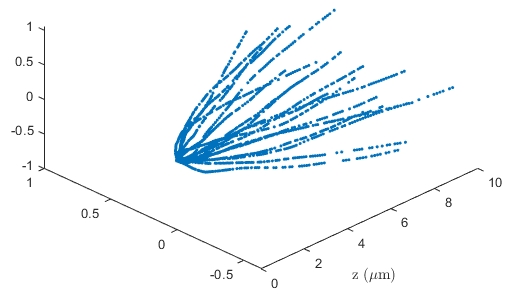

# imaging_diffusion

This repo shows an example of using AtomECS to simulate diffusion in an imaging system.
We use atomecs to simulate the scattering of photons by a cloud of atoms, and integrate the resulting atomic motion.
The `WritePhotonsSystem` writes the emitted photons to an output csv file, which can be analysed to produce a simulated image.

The example matlab file plots the positions of photons emitted during the simulation.

